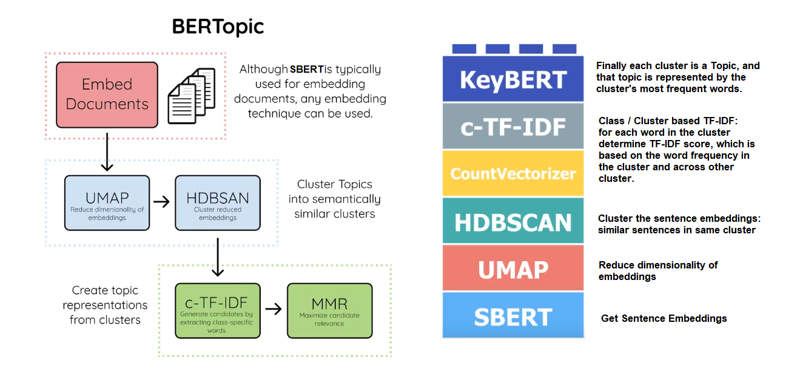
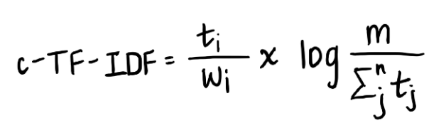
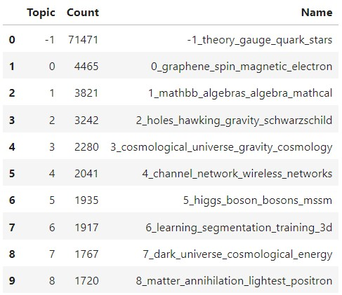

# Topic Modeling arXiv Abstracts using BERTopic

**BERTopic** is a topic modeling technique that leverages transformers and class-based-TF-IDF to create dense clusters allowing for easily interpretable topics whilst keeping important words in the topic descriptions.

BERTopic supports guided, (semi-) supervised, and dynamic topic modeling. It also supports visualizations similar to LDAvis!

BERTopic generates document embedding with pre-trained transformer-based language models, clusters these embeddings, and finally, generates topic representations with the class-based TF-IDF procedure. 

### Three main algorithm components

**Embed Documents:** Extract document embeddings with Sentence Transformers. Since the data we are working with are article titles, we will need to obtain sentence embeddings, which BERTopic lets us choose conveniently, from among many sentence transformer model.

**Cluster Documents:** Create groups of similar documents with UMAP (to reduce the dimensionality of embeddings) and HDBSCAN (to identify and cluster semantically similar documents)

**Create Topic Representation**: Extract and reduce topics with c-TF-IDF (class-based term frequency, inverse document frequency). 

TF-IDF allows for comparing the importance of words between documents by computing the frequency of a word in a given document and also the measure of how prevalent the word is in the entire corpus. 

Now, if we instead treat all documents in a single cluster as a single document and then perform TF-IDF, the result would be importance scores for words within a cluster. The more important words are within a cluster, the more representative they are of that topic. Therefore, we can obtain keyword-based descriptions for each topic! This is super powerful when it comes to inferring meaning from the groupings yielded by any unsupervised clustering technique.

c-TF-IDF formula: the frequency of each word t is extracted for each class i and divided by the total number of words w. The average number of words per class m is divided by the total frequency of word t across all n classes.

## Dataset

This dataset is a mirror of the original ArXiv data.

- `id`: ArXiv ID (can be used to access the paper, see below)
- `submitter`: Who submitted the paper
- `authors`: Authors of the paper
- `title`: Title of the paper
- `comments`: Additional info, such as number of pages and figures
- `journal`-ref: Information about the journal the paper was published in
- `doi`: [https://www.doi.org](Digital Object Identifier)
- `abstract`: The abstract of the paper
- `categories`: Categories / tags in the ArXiv system
- `versions`: A version history

[Dataset Link](https://zdataset.com/free-dataset/arxiv-dataset/)

## Train BERTopic Model
Implementing BERTopic on abstract data of all papers published between 2000 and 2021.

Using `all-mpnet-base-v2` **Embedding Model** which 420MB Model.

This is a **sentence-transformers** model: It maps sentences & paragraphs to a **768 dimensional** dense vector space and can be used for tasks like clustering or semantic search.

`fit_transform(documents, embeddings=None, y=None)`

- https://maartengr.github.io/BERTopic/api/bertopic.html#bertopic._bertopic.BERTopic.fit_transform
- Fit the models on a collection of documents, generate topics, and return the docs with topics
- Parameters:
    - `documents`:	List[str] :	a list of documents to fit on
    - `embeddings`:	np.ndarray : Pre-trained document embeddings. These can be used instead of the sentence-transformer model
    - `y`:	Union[List[int], np.ndarray] : The target class for (semi)-supervised modeling. Use -1 if no class for a specific instance is specified.= None

## Topics Generated: Visualizations

### Top-10 Topics Extracted by the Model:

### Top words of each Topic:

### Observing Variation of Term-Score (**c-TF-IDF** Score for Each Top Word) with Subsequent Words for Each Topic
Each topic is represented by a set of words. These words, however, do not all equally represent the topic. This visualization shows how many words are needed to represent a topic and at which point the beneficial effect of adding words starts to decline.

### Topic Relationships

#### Inter-Topic Distance:

#### Hierarchical Clustering : Dendogram Representation of Each Topic:

#### Similarity Matrix:
Darker region represents cluster of topics largly similar to each other.

### Topic Trend Over Time

### Topics per Class

`topics_per_class(docs, classes, global_tuning=True)`

**Topics** determined by the Model **for each original category of the dataset**.

To create the topics per class, BERTopic needs to be already fitted once. From the fitted models, the c-TF-IDF representations are calculate at each class c. Then, the c-TF-IDF representations at class c are averaged with the global c-TF-IDF representations in order to fine-tune the local representations.

